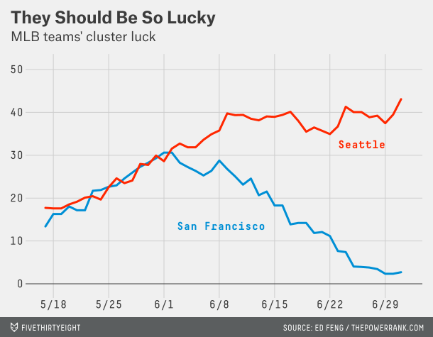
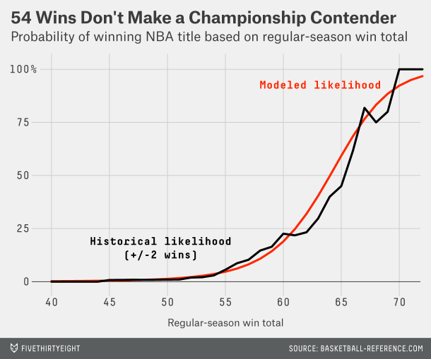
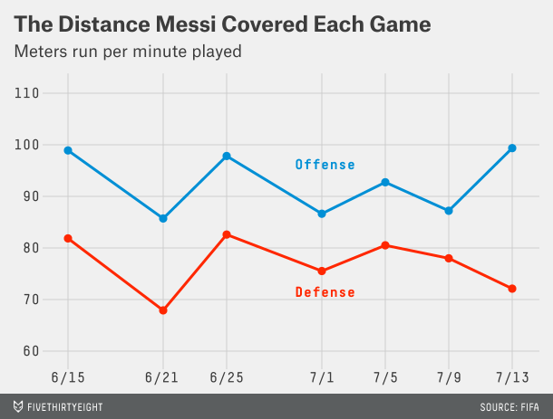

# fivethirtyeight.com ggplot2 theme

ggplot2 theme that mimics the style of [fivethirtyeight.com (538)](http://fivethirtyeight.com/) plots. 

The repository contains the following files:

* `theme_fivethirtyeight.R`: This is the actual theme  function which you need to add to your project
* `example.R`: A simple example making use of the 538 theme

You can install the theme with `source("theme_fivethirtyeight.R")`. Plots created with the 538 ggplot2 theme will look as follows:

Below you will find some general discussions which led to the theme design decisions. In addition, we highlight some aspects which cannot be modified with the ggplot2 theming system but which needs be changed in order to make your plots even more 538-like.

_Note:_ This little project was inspired by [Austin's (Clemens) blog post](http://austinclemens.com/blog/2014/07/03/fivethirtyeight-com-style-graphs-in-ggplot2/) of 538 style graphs in ggplot2. In his blog he modifies the theme object rather than defining a new theme function.

## Reviewing 538 plots

538 (time series) plots are not as consistent as you might think which gets obvious by taking a look at the three examples below:

**Example 1:**

**Example 2:**

**Example 3:**

In the first two examples the x-axis is emphasized but in two different ways. First, with a bold line colored in dark grey. Next, with a very thin black line. The third plot is not showing such a style element at all. 

The same is true for axis labels. Although most of the times they are not used, you will find cases in which either one axis is labeled (see Example 2) or both. However, 538 plots try to omit axis label usage as much as possible especially in time series plots.

## Deciding on the theme design

We decided the following when creating the ggplot2 538 theme function:

* x-axis is not highlighted
* x- and y-axis labels are omitted (but can be added later to the theme object)

Although fonts could be set in the theming function, we are not leveraging the two standard 538 fonts here because the are not available for free:

* Atlas Grotesk
* Decima Mono

Moreover, the following 538 plot elements cannot be replicated by the ggplot2 theming system:
* The plot footer which inlcudes the 538 logo and the data source
* The subtitle using a smaller fonts than the main plot title

## Building the theme function

In general, ggplot2 provides two ways for writing user-defined theme functions which are described in the [ggplot2 themes vignette](http://docs.ggplot2.org/dev/vignettes/themes.html):

* Write an entire new theme function in the style of `theme_grey`
* Use the  `%+replace%` operator which is primarily used to create new themes

Here, we chose the second option by deriving the 538 theme from `theme_grey` 

Regardless in which way you create a new theme function, it is crucial that you understand ggplot's theme inheritance structure which looks as follows:

For example, once a theme element was set to `element_blank()` somewhere upstream the inheritance branch, a specific setting of a child's properties in the theme object or in a derived theme function will have absolutely no effect. 

For instance, take a look at the following theme object modification of the standard ggplot2 theme `theme_grey`:

    library(ggplot2)
    ggplot(diamonds, aes(carat, price)) + geom_point() +
    theme(axis.line.x = element_line(colour = 'red'))
    
The x-axis won't show up in red because `axis.line` is set to `element_blank()` in `theme_grey`. If you wish to highlight just the x-axis in red you have add the following modifications which respect the inheritance structure:

    theme(axis.line = element_line(colour = 'red'),
          axis.line.y = element_blank())

